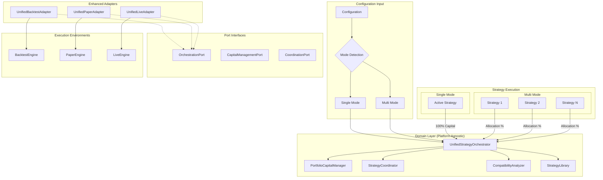
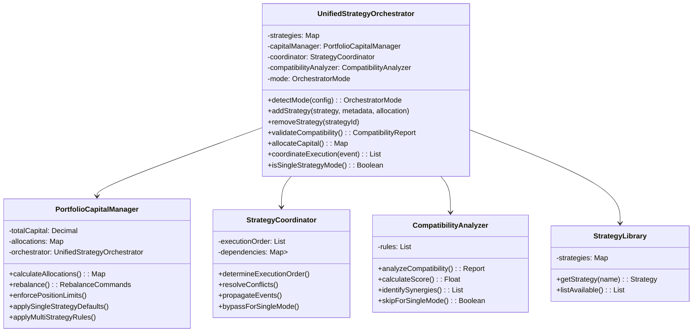
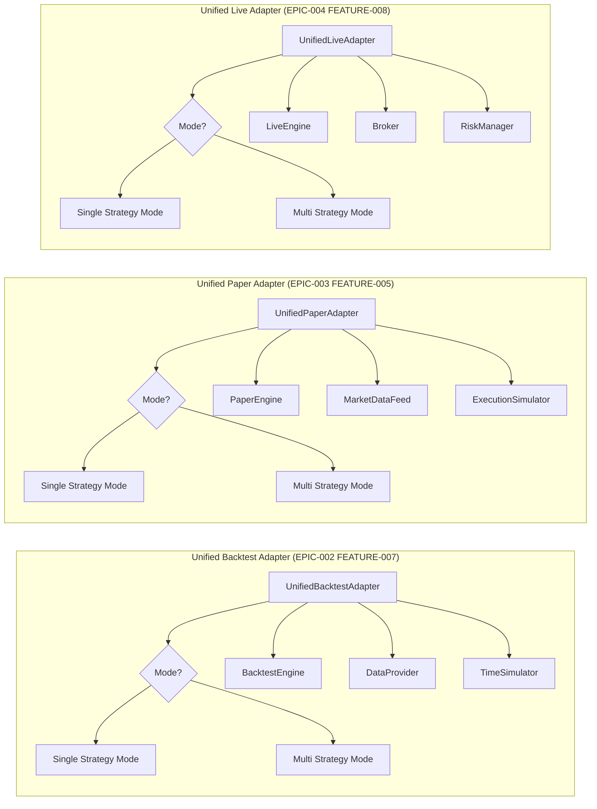
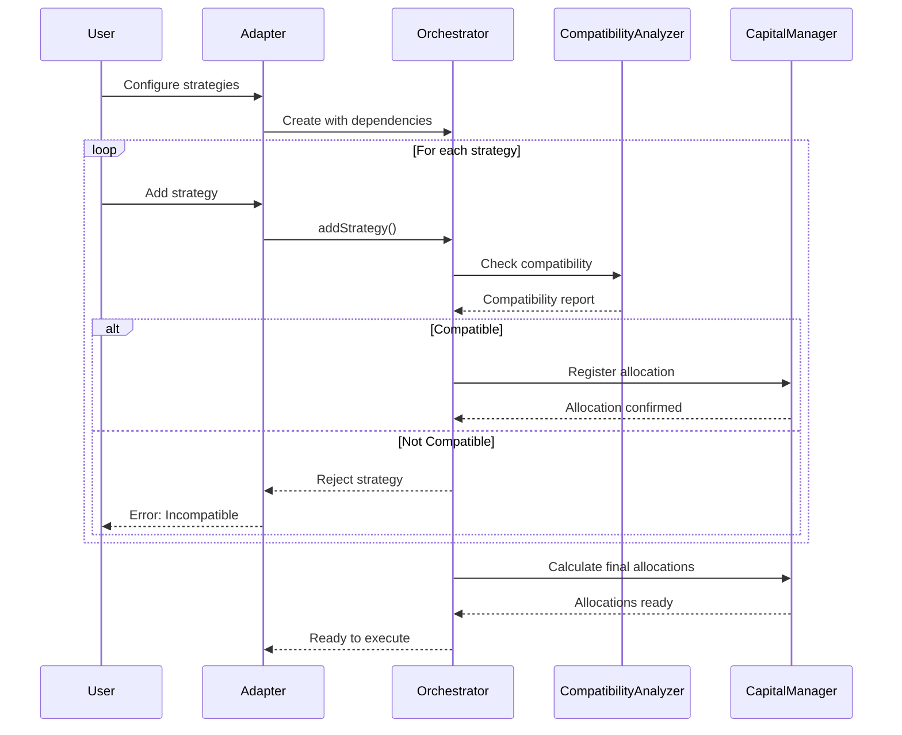
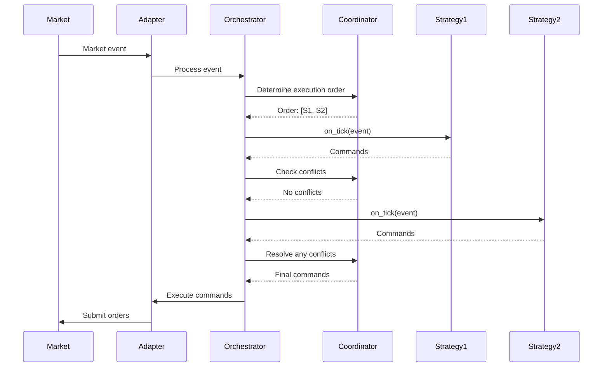
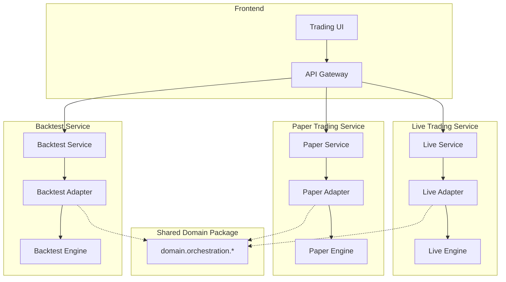
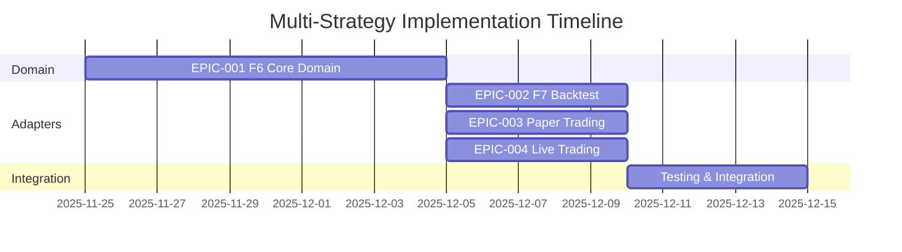

# Unified Strategy Trading Platform Architecture

## Executive Summary

This document defines the comprehensive architecture for unified strategy trading capabilities across the SynapticTrading platform. The design supports BOTH single-strategy mode (library pattern with one active strategy) and multi-strategy mode (concurrent execution of 2-3 strategies) using the same infrastructure. This ensures consistent behavior across all environments (backtest, paper, or live) while maintaining clean separation between domain logic and infrastructure concerns.

## 1. Architecture Overview

### 1.1 Core Principles

1. **Unified Approach**: Single orchestrator handles both single and multi-strategy modes
2. **Configuration-Driven**: Mode auto-detected from configuration structure
3. **Domain-Infrastructure Separation**: Core orchestration logic is platform-agnostic
4. **Enhanced Adapter Pattern**: Existing adapters enhanced, not replaced
5. **Shared Domain Model**: One orchestrator, all environments
6. **Event-Driven Communication**: Strategies communicate via domain events
7. **Pluggable Architecture**: Easy to add new strategies or execution environments

### 1.2 High-Level Architecture



## 2. Component Architecture

### 2.1 Domain Components (EPIC-001 FEATURE-006)



### 2.2 Port Interfaces

```python
from typing import Protocol, List, Dict
from decimal import Decimal

class OrchestrationPort(Protocol):
    """Port for execution environment integration."""
    
    def execute_commands(self, commands: List[StrategyCommand]) -> None:
        """Execute strategy commands in the specific environment."""
        ...
        
    def get_portfolio_state(self) -> PortfolioState:
        """Get current portfolio state from the environment."""
        ...
        
    def get_market_data(self) -> MarketData:
        """Get current market data from the environment."""
        ...

class CapitalManagementPort(Protocol):
    """Port for capital management operations."""
    
    def get_available_capital(self) -> Decimal:
        """Get available capital for allocation."""
        ...
        
    def update_allocations(self, allocations: Dict[str, Decimal]) -> None:
        """Update strategy allocations."""
        ...

class CoordinationPort(Protocol):
    """Port for strategy coordination."""
    
    def lock_instrument(self, instrument: str, strategy_id: str) -> bool:
        """Lock an instrument for exclusive use by a strategy."""
        ...
        
    def broadcast_event(self, event: DomainEvent) -> None:
        """Broadcast event to all strategies."""
        ...
```

### 2.3 Enhanced Infrastructure Adapters



## 3. Data Flow Architecture

### 3.1 Initialization Flow



### 3.2 Execution Flow



## 4. Deployment Architecture

### 4.1 Component Deployment



### 4.2 Package Structure

```
src/
├── domain/                           # Shared domain layer
│   ├── orchestration/
│   │   ├── __init__.py
│   │   ├── multi_strategy_orchestrator.py
│   │   ├── portfolio_capital_manager.py
│   │   ├── strategy_coordinator.py
│   │   ├── compatibility_analyzer.py
│   │   └── events.py
│   ├── models/
│   │   └── ...
│   └── ports/
│       ├── orchestration_port.py
│       ├── capital_management_port.py
│       └── coordination_port.py
│
├── adapters/
│   ├── frameworks/
│   │   ├── backtest/
│   │   │   ├── backtest_multi_strategy_adapter.py
│   │   │   └── ...
│   │   ├── paper/
│   │   │   ├── paper_multi_strategy_adapter.py
│   │   │   └── ...
│   │   └── live/
│   │       ├── live_multi_strategy_adapter.py
│   │       └── ...
│   └── ...
│
└── services/
    ├── backtest_service.py
    ├── paper_service.py
    └── live_service.py
```

## 5. Implementation Roadmap

### 5.1 Phase 1: Domain Model (EPIC-001 FEATURE-006)
**Duration**: 2 weeks
**Dependencies**: None

1. Implement core orchestration logic
2. Create capital management algorithms
3. Build strategy coordination logic
4. Develop compatibility analyzer
5. Define port interfaces

**Can Start**: Immediately

### 5.2 Phase 2: Backtest Adapter (EPIC-002 FEATURE-007)
**Duration**: 1 week
**Dependencies**: Phase 1 complete

1. Implement backtest adapter
2. Integrate with existing engines
3. Handle historical data
4. Create consolidated results

**Can Start**: After Phase 1

### 5.3 Phase 3: Paper Trading Adapter (EPIC-003 FEATURE-XXX)
**Duration**: 1 week
**Dependencies**: Phase 1 complete

1. Implement paper adapter
2. Real-time data integration
3. Simulated execution
4. Position tracking

**Can Start**: After Phase 1 (parallel with Phase 2)

### 5.4 Phase 4: Live Trading Adapter (EPIC-004 FEATURE-XXX)
**Duration**: 1 week
**Dependencies**: Phase 1 complete

1. Implement live adapter
2. Broker integration
3. Risk management hooks
4. Compliance checks

**Can Start**: After Phase 1 (parallel with Phase 2 & 3)

### 5.5 Phase 5: Integration & Testing
**Duration**: 1 week
**Dependencies**: Phases 2-4 complete

1. End-to-end testing
2. Performance optimization
3. Documentation
4. Deployment preparation

## 6. Parallelization Analysis

### 6.1 What Can Be Done in Parallel?



### 6.2 Dependencies Summary

**Must Complete First**:
- EPIC-001 FEATURE-006 (Domain Model) - This is the foundation

**Can Be Done in Parallel** (after domain model):
- EPIC-002 FEATURE-007 (Backtest Adapter)
- EPIC-003 Paper Trading Adapter
- EPIC-004 Live Trading Adapter

**Rationale**: 
- The domain model contains all business logic and must be complete first
- Each adapter is independent and only depends on the domain interfaces
- Different teams can work on different adapters simultaneously
- Integration testing happens after all adapters are complete

### 6.3 Team Allocation

**Team 1**: Core Architecture Team
- Focus: EPIC-001 FEATURE-006
- Duration: 2 weeks
- Skills: Domain modeling, architecture

**Team 2**: Backtesting Team
- Focus: EPIC-002 FEATURE-007
- Start: Week 3
- Skills: Backtesting engines, historical data

**Team 3**: Trading Team
- Focus: EPIC-003 & EPIC-004 adapters
- Start: Week 3
- Skills: Real-time systems, broker APIs

## 7. Key Design Decisions

### 7.1 Why Unified Approach?

1. **Single Codebase**: One orchestrator handles both modes
2. **Consistent Behavior**: Same logic whether N=1 or N>1
3. **Easy Switching**: Change modes via configuration only
4. **Code Reuse**: No duplication between single/multi implementations
5. **Gradual Adoption**: Start single, move to multi when ready

### 7.2 Why Enhance Existing Adapters?

1. **No Breaking Changes**: Existing code continues to work
2. **Incremental Enhancement**: Add unified support gradually
3. **Less Code**: Avoid creating separate adapter hierarchies
4. **Simpler Testing**: One set of adapter tests
5. **Better Maintenance**: Single adapter to maintain per environment

### 7.3 Why Configuration-Driven Mode?

1. **User Friendly**: No code changes to switch modes
2. **Auto-Detection**: System determines mode from config structure
3. **Clear Intent**: Config structure shows user's intent
4. **Backward Compatible**: Old configs continue to work
5. **A/B Testing**: Easy to test strategies individually

### 7.4 Why Separate Domain from Infrastructure?

1. **Reusability**: Write orchestration logic once, use everywhere
2. **Testability**: Domain logic can be tested without infrastructure
3. **Flexibility**: Easy to add new execution environments
4. **Maintainability**: Changes to engines don't affect domain logic

### 7.5 Event-Driven Communication

1. **Decoupling**: Strategies don't know about each other
2. **Flexibility**: Easy to add/remove strategies
3. **Auditability**: All communications are traceable
4. **Extensibility**: New event types can be added

## 8. Example Usage

### 8.1 Unified Backtest Usage

```python
# Create unified orchestrator (same for all modes and environments)
orchestrator = UnifiedStrategyOrchestrator(
    capital_manager=PortfolioCapitalManager(),
    coordinator=StrategyCoordinator(),
    compatibility_analyzer=CompatibilityAnalyzer()
)

# Example 1: Single-Strategy Mode
single_config = {
    "strategy": "OPTIONS_MONTHLY_WEEKLY_HEDGE",
    "config": {
        "num_lots": 4,
        "max_positions": 3
    }
}

# Example 2: Multi-Strategy Mode
multi_config = {
    "strategies": {
        "OPTIONS_MONTHLY_WEEKLY_HEDGE": {
            "enabled": true,
            "allocation_pct": 60.0,
            "config": {"num_lots": 4}
        },
        "MOMENTUM_FUTURES": {
            "enabled": true,
            "allocation_pct": 40.0,
            "config": {"leverage": 2.0}
        }
    }
}

# Create unified backtest adapter
adapter = UnifiedBacktestAdapter(
    orchestrator=orchestrator,
    engine=BacktestEngine(),
    data_provider=HistoricalDataProvider()
)

# Run backtest - adapter auto-detects mode
results = adapter.run_backtest(
    config=single_config,  # or multi_config
    start_date="2024-01-01",
    end_date="2024-12-31"
)
```

### 8.2 Unified Paper Trading Usage

```python
# Same orchestrator setup...

# Create unified paper trading adapter
adapter = UnifiedPaperAdapter(
    orchestrator=orchestrator,  # Same orchestrator!
    engine=PaperEngine(),
    market_data=RealtimeDataFeed()
)

# Start paper trading - adapter auto-detects mode
adapter.start_paper_trading(config=single_config)  # or multi_config
```

### 8.3 Unified Live Trading Usage

```python
# Same orchestrator setup...

# Create unified live trading adapter
adapter = UnifiedLiveAdapter(
    orchestrator=orchestrator,  # Same orchestrator!
    engine=LiveEngine(),
    broker=BrokerConnection()
)

# Start live trading - adapter auto-detects mode and applies appropriate risk
adapter.start_live_trading(
    config=single_config,  # or multi_config
    risk_limits=RiskLimits(max_drawdown=0.10)
)
```

### 8.4 Mode Switching Example

```python
# Development: Test single strategy
dev_config = {
    "strategy": "NEW_EXPERIMENTAL_STRATEGY",
    "config": {"param1": 10, "param2": 20}
}

# Production: Run proven portfolio
prod_config = {
    "strategies": {
        "PROVEN_STRATEGY_1": {"enabled": true, "allocation_pct": 50.0},
        "PROVEN_STRATEGY_2": {"enabled": true, "allocation_pct": 30.0},
        "PROVEN_STRATEGY_3": {"enabled": true, "allocation_pct": 20.0}
    }
}

# Same adapter handles both!
adapter.run_backtest(config=dev_config)   # Single mode
adapter.run_backtest(config=prod_config)  # Multi mode
```

## 9. Performance Considerations

### 9.1 Optimization Strategies

1. **Shared Data**: Cache market data across strategies
2. **Parallel Execution**: Run independent strategies in parallel
3. **Lazy Loading**: Load strategy-specific data on demand
4. **Event Batching**: Process multiple events together

### 9.2 Scalability Targets

| Metric | Target | Notes |
|--------|--------|-------|
| Strategies per instance | 10-20 | Hardware dependent |
| Events per second | 1000+ | Backtest mode |
| Latency (paper/live) | <10ms | 99th percentile |
| Memory per strategy | <500MB | Excluding data |

## 10. Security Considerations

### 10.1 Strategy Isolation

1. Strategies cannot access each other's data directly
2. All communication via controlled events
3. Resource limits per strategy
4. Audit trail for all operations

### 10.2 Capital Protection

1. Hard limits on capital allocation
2. Position size validation
3. Risk checks at multiple levels
4. Emergency stop capabilities

## 11. Monitoring & Observability

### 11.1 Metrics

1. **Performance**: P&L, Sharpe, drawdown per strategy
2. **Execution**: Order fill rates, latency
3. **System**: CPU, memory, network usage
4. **Risk**: Exposure, concentration, correlation

### 11.2 Logging

Following v2.0.0 specification with extensions:
- Strategy-level logs
- Consolidated portfolio logs
- Event trace logs
- Performance attribution logs

## 12. Conclusion

This architecture provides a robust foundation for multi-strategy trading across all execution environments. The clean separation between domain logic and infrastructure ensures maintainability, testability, and extensibility as the platform evolves.

### Next Steps

1. **Immediate**: Start EPIC-001 FEATURE-006 implementation
2. **Week 3**: Begin parallel adapter development
3. **Week 5**: Integration testing
4. **Week 6**: Production readiness review

### Success Criteria

- [ ] All strategies work identically across environments
- [ ] Performance meets targets
- [ ] Clean architecture maintained
- [ ] Comprehensive test coverage
- [ ] Documentation complete