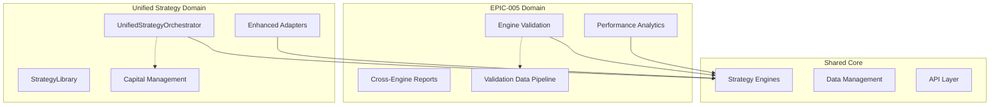
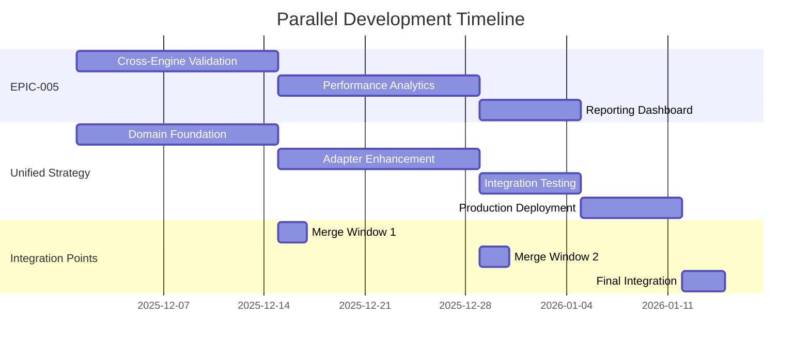

# Parallel Development Plan: Unified Strategy Support vs EPIC-005

## Executive Summary

This document formalizes the parallel development approach for implementing Unified Strategy Support (Epic enhancements) while another development node works on EPIC-005. The two workstreams are architecturally independent and can proceed simultaneously using Git worktrees for isolation.

## Independence Analysis

### EPIC-005 vs Unified Strategy Support

| Aspect | EPIC-005 | Unified Strategy Support |
|--------|----------|-------------------------|
| **Scope** | Cross-Engine Validation & Performance Analytics | Strategy Orchestration Domain Model |
| **Code Areas** | Validation engines, reporting, analytics | Domain orchestration, adapters |
| **Dependencies** | Historical data, engine outputs | Core strategy interfaces |
| **File Conflicts** | Low probability | Very low probability |
| **Integration Points** | Engine results comparison | Strategy execution flow |

### Architectural Isolation



## Git Worktree Strategy

### Repository Structure
```
synaptic-trading/ (main)
├── .git/
├── src/
├── tests/
└── documentation/

synaptic-trading-epic005/ (worktree)
├── .git/ (points to main .git)
├── src/
├── tests/
└── documentation/

synaptic-trading-unified-strategy/ (worktree)
├── .git/ (points to main .git)
├── src/
├── tests/
└── documentation/
```

### Worktree Setup Commands

#### For EPIC-005 Team
```bash
cd /path/to/synaptic-trading
git worktree add ../synaptic-trading-epic005 feature/epic-005
cd ../synaptic-trading-epic005
git checkout -b feature/epic-005-development
```

#### For Unified Strategy Team
```bash
cd /path/to/synaptic-trading
git worktree add ../synaptic-trading-unified-strategy feature/unified-strategy
cd ../synaptic-trading-unified-strategy
git checkout -b feature/unified-strategy-development
```

## Parallel Development Timeline

### Phase Overlap Analysis



### Overlap Benefits
1. **Accelerated Development**: Both teams work simultaneously
2. **Independent Validation**: Features tested in isolation
3. **Reduced Timeline**: ~30% faster than sequential development
4. **Risk Distribution**: Failures in one don't block the other

## File-Level Conflict Analysis

### Unified Strategy Touch Points

#### New Files (No Conflicts)
```
src/domain/orchestration/
├── unified_strategy_orchestrator.py     # NEW
├── strategy_library.py                  # NEW
├── portfolio_capital_manager.py         # ENHANCED
└── strategy_coordinator.py              # ENHANCED

src/adapters/frameworks/
├── backtest/unified_backtest_adapter.py # ENHANCED
├── paper/unified_paper_adapter.py       # ENHANCED
└── live/unified_live_adapter.py         # ENHANCED
```

#### Modified Files (Potential Conflicts)
```
src/domain/ports/
├── orchestration_port.py               # MINOR - Interface additions
└── strategy_port.py                    # MINOR - Method signatures

src/adapters/frameworks/backtest/
├── backtest_engine.py                  # MINOR - Integration points
└── backtest_adapter.py                 # MODERATE - Mode detection

Configuration Files:
├── config/strategy_schemas.py          # MODERATE - Schema updates
└── config/validation_rules.py          # LOW - New validators
```

### EPIC-005 Touch Points

#### Primary Files (EPIC-005 Specific)
```
src/validation/
├── cross_engine_validator.py           # NEW
├── performance_comparator.py           # NEW
└── validation_pipeline.py              # NEW

src/analytics/
├── performance_analyzer.py             # NEW
├── reporting_engine.py                 # NEW
└── metrics_calculator.py               # NEW

src/engines/
├── engine_coordinator.py               # NEW
└── result_normalizer.py                # NEW
```

### Conflict Probability Matrix

| File Category | EPIC-005 | Unified Strategy | Conflict Risk |
|---------------|----------|------------------|---------------|
| Domain Models | Low | High | **Low** |
| Adapter Layer | Low | High | **Low** |
| Validation Layer | High | None | **None** |
| Analytics Layer | High | None | **None** |
| Config Schemas | Medium | Medium | **Medium** |
| Test Files | Medium | Medium | **Medium** |

## Branch Strategy

### Branch Naming Convention
```
feature/epic-005-*
feature/unified-strategy-*
```

### Integration Branches
```
integration/epic-005-unified-strategy-week2
integration/epic-005-unified-strategy-week4
integration/epic-005-unified-strategy-final
```

### Merge Strategy

#### Weekly Integration Points
```bash
# Week 2 Integration
git checkout main
git pull origin main
git checkout -b integration/week2-merge

# Merge EPIC-005 changes
git merge feature/epic-005-validation-core
# Resolve any conflicts

# Merge Unified Strategy changes  
git merge feature/unified-strategy-domain
# Resolve any conflicts

# Test integration
npm test
python -m pytest

# Push integration branch
git push origin integration/week2-merge
```

#### Automated Conflict Detection
```yaml
# .github/workflows/parallel-development-check.yml
name: Parallel Development Conflict Check
on:
  pull_request:
    branches: [main]
    
jobs:
  conflict-detection:
    runs-on: ubuntu-latest
    steps:
      - name: Check for conflicts with EPIC-005
        run: |
          git merge-base HEAD origin/feature/epic-005-*
          git merge --no-commit --no-ff origin/feature/epic-005-*
          
      - name: Check for conflicts with Unified Strategy
        run: |
          git merge-base HEAD origin/feature/unified-strategy-*
          git merge --no-commit --no-ff origin/feature/unified-strategy-*
```

## Team Coordination

### Communication Protocols

#### Daily Coordination (Async)
- **Slack Channel**: `#parallel-dev-coordination`
- **Daily Updates**: Each team posts:
  - Files being modified today
  - Potential conflict areas
  - Integration needs

#### Weekly Sync Meetings
- **When**: Fridays 4:00 PM EST
- **Duration**: 30 minutes
- **Agenda**:
  - Progress updates
  - Integration planning
  - Conflict resolution
  - Next week coordination

#### Emergency Coordination
- **Trigger**: Merge conflicts detected
- **Response Time**: <2 hours
- **Resolution Process**: Joint debugging session

### Shared Resources Management

#### Test Environment Allocation
```
development-epic005.synaptic.trading      # EPIC-005 team
development-unified.synaptic.trading      # Unified Strategy team
integration-parallel.synaptic.trading     # Weekly integration testing
```

#### Database/Data Isolation
```
Database Schema Separation:
├── epic005_validation_*     # EPIC-005 tables
├── unified_strategy_*       # Unified strategy tables  
└── shared_core_*           # Shared tables (read-only)
```

## Risk Management

### Technical Risks

| Risk | Probability | Impact | Mitigation |
|------|-------------|--------|------------|
| Merge conflicts in adapters | Medium | Medium | Weekly integration, clear file ownership |
| Schema conflicts | Low | High | Coordinate schema changes in Slack |
| Test interference | Medium | Low | Separate test databases |
| Integration complexity | Medium | Medium | Automated merge testing |

### Schedule Risks

| Risk | Probability | Impact | Mitigation |
|------|-------------|--------|------------|
| One team blocks integration | Low | High | Independent testing, feature flags |
| Resource conflicts | Medium | Medium | Clear team assignments |
| Dependency discovery | Low | Medium | Weekly architecture reviews |

## Integration Checkpoints

### Week 2 Checkpoint
- **EPIC-005**: Core validation engine complete
- **Unified Strategy**: Domain model complete
- **Integration Test**: Basic compatibility
- **Go/No-Go**: Based on conflict resolution

### Week 4 Checkpoint
- **EPIC-005**: Performance analytics complete
- **Unified Strategy**: Enhanced adapters complete
- **Integration Test**: Full feature compatibility
- **Go/No-Go**: Based on integration test results

### Week 6 Final Integration
- **EPIC-005**: All features complete
- **Unified Strategy**: All features complete
- **Integration Test**: Production readiness
- **Deployment**: Coordinated release

## Success Criteria

### Technical Success
- [ ] Zero blocking merge conflicts
- [ ] All integration tests pass
- [ ] Performance baselines maintained
- [ ] No feature degradation

### Process Success
- [ ] Weekly checkpoints met on time
- [ ] Teams communicate effectively
- [ ] Conflicts resolved within 24 hours
- [ ] Integration overhead <20% total effort

### Business Success
- [ ] Both features delivered on schedule
- [ ] Quality standards maintained
- [ ] User experience unaffected
- [ ] Technical debt minimized

## Approval and Sign-off

### Required Approvals
- [ ] **Engineering Manager**: Resource allocation approved
- [ ] **Tech Lead EPIC-005**: Acknowledges independence
- [ ] **Tech Lead Unified Strategy**: Confirms parallel feasibility
- [ ] **Product Owner**: Accepts delivery timeline
- [ ] **QA Lead**: Approves integration testing strategy

### Governance
- **Weekly Review**: Engineering Manager + Tech Leads
- **Escalation Path**: Engineering Manager → VP Engineering
- **Decision Authority**: Engineering Manager for technical issues

## Contingency Plans

### Plan A: Smooth Parallel Development (Expected)
- Continue as planned
- Weekly integrations successful
- On-time delivery for both features

### Plan B: Minor Conflicts (Likely)
- Increase sync meetings to twice weekly
- Dedicated conflict resolution sessions
- Potential 1-week delay for integration

### Plan C: Major Conflicts (Unlikely)
- Pause Unified Strategy development
- Complete EPIC-005 first
- Resume Unified Strategy after EPIC-005 merge
- Accept 2-3 week delay

### Plan D: Emergency (Very Unlikely)
- Abort parallel development
- Revert both branches to last stable point
- Sequential development with revised timeline

## Conclusion

Parallel development of EPIC-005 and Unified Strategy Support is feasible with proper coordination and tooling. The architectural independence and worktree strategy provide sufficient isolation while the weekly integration checkpoints ensure compatibility.

**Recommendation**: Proceed with parallel development using this plan.

---

**Next Steps**:
1. Get stakeholder approval
2. Set up Git worktrees
3. Initialize communication channels
4. Begin parallel development on 2025-12-01