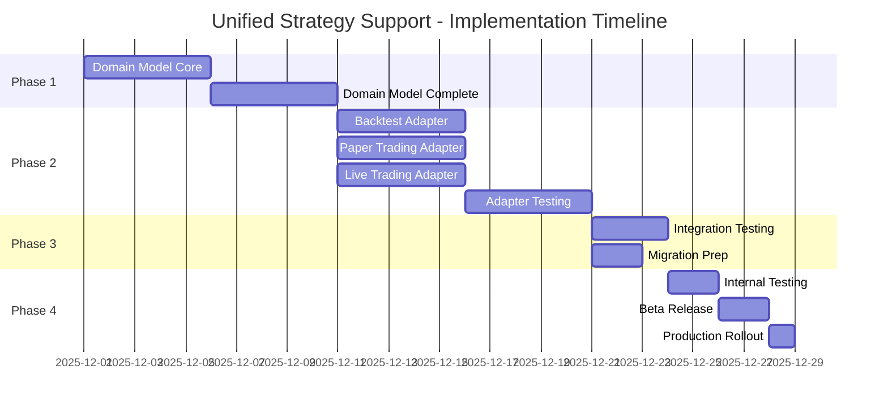

# Unified Strategy Support - Release Plan

## Executive Summary

This release plan outlines the implementation of unified strategy support across the SynapticTrading platform. The plan enables both single-strategy mode (library pattern) and multi-strategy mode (concurrent execution) using a single codebase, ensuring consistent behavior across all execution environments.

## Release Overview

### Release Goals
1. **Implement unified orchestration domain model** supporting both modes
2. **Enhance existing adapters** instead of creating new ones
3. **Maintain backward compatibility** with existing implementations
4. **Enable configuration-driven mode selection**
5. **Support gradual adoption** from single to multi-strategy

### Success Metrics
- Zero breaking changes to existing APIs
- Single/multi mode switching via configuration only
- <5% performance overhead for single-strategy mode
- All existing tests continue to pass
- New unified tests achieve >90% coverage

## Release Phases

### Phase 1: Domain Foundation (Weeks 1-2)
**Epic**: EPIC-001 FEATURE-006
**Team**: Core Architecture Team

#### Week 1: Core Domain Implementation
- [ ] Implement `UnifiedStrategyOrchestrator` with mode detection
- [ ] Create `StrategyLibrary` for single-strategy mode
- [ ] Implement mode-aware `PortfolioCapitalManager`
- [ ] Add configuration schema validators
- [ ] Unit tests for mode detection logic

#### Week 2: Domain Completion
- [ ] Complete `StrategyCoordinator` with single-mode bypass
- [ ] Implement `CompatibilityAnalyzer` with mode awareness
- [ ] Define all port interfaces
- [ ] Create domain events
- [ ] Achieve 95% test coverage

**Deliverables**:
- Unified orchestration domain model
- Strategy library implementation
- Port interfaces for adapters
- Comprehensive unit tests

### Phase 2: Adapter Enhancement (Weeks 3-4)
**Teams**: Backtesting, Paper Trading, Live Trading Teams (in parallel)

#### Week 3: Adapter Implementation
**Parallel Work Streams**:

**Stream 1: Backtest Adapter (EPIC-002 FEATURE-007)**
- [ ] Enhance existing backtest adapter with unified orchestrator
- [ ] Implement mode detection in `run_backtest()`
- [ ] Add single-strategy library support
- [ ] Update multi-strategy execution logic
- [ ] Create mode-specific result formatters

**Stream 2: Paper Trading Adapter (EPIC-003 FEATURE-005)**
- [ ] Enhance existing paper adapter with unified orchestrator
- [ ] Implement mode detection in `start_paper_trading()`
- [ ] Add real-time data handling for both modes
- [ ] Update position tracking for mode awareness
- [ ] Create mode-specific monitoring

**Stream 3: Live Trading Adapter (EPIC-004 FEATURE-008)**
- [ ] Enhance existing live adapter with unified orchestrator
- [ ] Implement mode detection in `start_live_trading()`
- [ ] Add mode-specific risk management
- [ ] Update compliance checks for both modes
- [ ] Implement mode-aware kill switch

#### Week 4: Adapter Testing & Integration
- [ ] Integration tests for each adapter
- [ ] Cross-engine validation tests
- [ ] Performance benchmarking
- [ ] Mode switching tests
- [ ] Error handling validation

**Deliverables**:
- Enhanced adapters supporting both modes
- Integration test suites
- Performance benchmarks
- Migration guides

### Phase 3: Integration & Migration (Week 5)
**Team**: All teams

#### Integration Testing
- [ ] End-to-end testing across all environments
- [ ] Configuration validation testing
- [ ] Mode switching scenarios
- [ ] Backward compatibility verification
- [ ] Load testing for both modes

#### Migration Preparation
- [ ] Create migration guide for existing users
- [ ] Document configuration changes
- [ ] Prepare rollback procedures
- [ ] Update API documentation
- [ ] Create example configurations

**Deliverables**:
- Validated integrated system
- Migration documentation
- Rollback procedures
- Updated API docs

### Phase 4: Staged Rollout (Week 6)
**Team**: DevOps + All teams

#### Stage 1: Internal Testing
- [ ] Deploy to development environment
- [ ] Run automated test suites
- [ ] Conduct manual testing
- [ ] Validate monitoring and logging
- [ ] Performance profiling

#### Stage 2: Beta Release
- [ ] Deploy to staging environment
- [ ] Select beta users for testing
- [ ] Monitor system behavior
- [ ] Collect feedback
- [ ] Fix critical issues

#### Stage 3: Production Release
- [ ] Deploy to production (feature flag controlled)
- [ ] Gradual rollout (10% → 50% → 100%)
- [ ] Monitor performance metrics
- [ ] Support early adopters
- [ ] Document lessons learned

**Deliverables**:
- Production-ready system
- Monitoring dashboards
- Support documentation
- Post-mortem report

## Implementation Timeline



## Risk Management

### Technical Risks

| Risk | Impact | Mitigation |
|------|--------|------------|
| Performance regression in single mode | High | Benchmark early, optimize hot paths |
| Breaking changes to existing code | High | Comprehensive backward compatibility tests |
| Mode detection failures | Medium | Extensive config validation, clear error messages |
| Integration complexity | Medium | Parallel development, early integration tests |

### Rollback Strategy

1. **Feature Flags**: All unified features behind flags
2. **Dual Mode**: Keep old code paths during transition
3. **Staged Rollback**: Reverse rollout percentage
4. **Data Safety**: No data migration required
5. **Quick Revert**: Git tags for each release stage

## Team Assignments

### Core Teams
- **Architecture Team**: Domain model, interfaces (Weeks 1-2)
- **Backtesting Team**: Backtest adapter enhancement (Weeks 3-4)
- **Trading Team**: Paper/Live adapter enhancement (Weeks 3-4)
- **QA Team**: Test automation, validation (Weeks 4-5)
- **DevOps Team**: Deployment, monitoring (Week 6)

### Cross-Team Coordination
- Daily standups during Phase 2 (parallel work)
- Weekly architecture reviews
- Integration checkpoints every 2 days
- Shared Slack channel for quick resolution

## Configuration Migration Examples

### Before (Separate Configs)
```json
// Single strategy config
{
  "strategy_name": "OPTIONS_MONTHLY_WEEKLY_HEDGE",
  "capital": 1000000,
  "params": {...}
}

// Multi strategy config  
{
  "multi_strategy": true,
  "strategies": [...]
}
```

### After (Unified Config)
```json
// Single mode - auto-detected
{
  "strategy": "OPTIONS_MONTHLY_WEEKLY_HEDGE",
  "config": {...}
}

// Multi mode - auto-detected
{
  "strategies": {
    "STRATEGY_1": {...},
    "STRATEGY_2": {...}
  }
}
```

## Success Criteria

### Phase 1 Complete
- [ ] Domain model passes all unit tests
- [ ] Mode detection works correctly
- [ ] No infrastructure dependencies

### Phase 2 Complete
- [ ] All adapters enhanced
- [ ] Integration tests passing
- [ ] Performance benchmarks met

### Phase 3 Complete
- [ ] E2E tests passing
- [ ] Migration guide complete
- [ ] Zero backward compatibility issues

### Phase 4 Complete
- [ ] Production deployment successful
- [ ] No critical issues in first 48 hours
- [ ] Performance metrics within targets
- [ ] User adoption tracking enabled

## Communication Plan

### Internal Communication
- **Kickoff Meeting**: Week 0 with all teams
- **Daily Standups**: During parallel development
- **Weekly Demos**: Progress demonstrations
- **Slack Updates**: Real-time coordination

### External Communication
- **User Announcement**: 2 weeks before release
- **Migration Guide**: 1 week before release
- **Beta Program**: Invite key users
- **Release Notes**: Comprehensive changelog

## Post-Release Support

### Week 1 Post-Release
- 24/7 on-call rotation
- Daily metrics review
- Quick fix deployment process
- User feedback collection

### Week 2-4 Post-Release
- Normal support hours
- Weekly metrics review
- Feature refinements
- Documentation updates

## Appendix: Technical Details

### A. Dependencies Between Components
```
EPIC-001 FEATURE-006 (Domain Model)
    ↓
├── EPIC-002 FEATURE-007 (Backtest Adapter)
├── EPIC-003 FEATURE-005 (Paper Adapter)
└── EPIC-004 FEATURE-008 (Live Adapter)
```

### B. Testing Strategy
1. **Unit Tests**: Each component in isolation
2. **Integration Tests**: Adapter + Domain integration
3. **E2E Tests**: Full workflow validation
4. **Performance Tests**: Single vs Multi mode comparison
5. **Chaos Tests**: Failure scenario handling

### C. Monitoring Requirements
- Mode detection success rate
- Performance metrics by mode
- Configuration validation errors
- Adapter enhancement adoption
- User migration progress

### D. Documentation Updates
- [ ] Architecture documentation
- [ ] API reference updates
- [ ] Configuration guide
- [ ] Migration guide
- [ ] Troubleshooting guide
- [ ] Example repositories

## Conclusion

This phased approach ensures a smooth transition to unified strategy support while maintaining system stability. The parallel development in Phase 2 accelerates delivery, while comprehensive testing and staged rollout minimize risk. The configuration-driven approach ensures users can adopt the new features at their own pace.